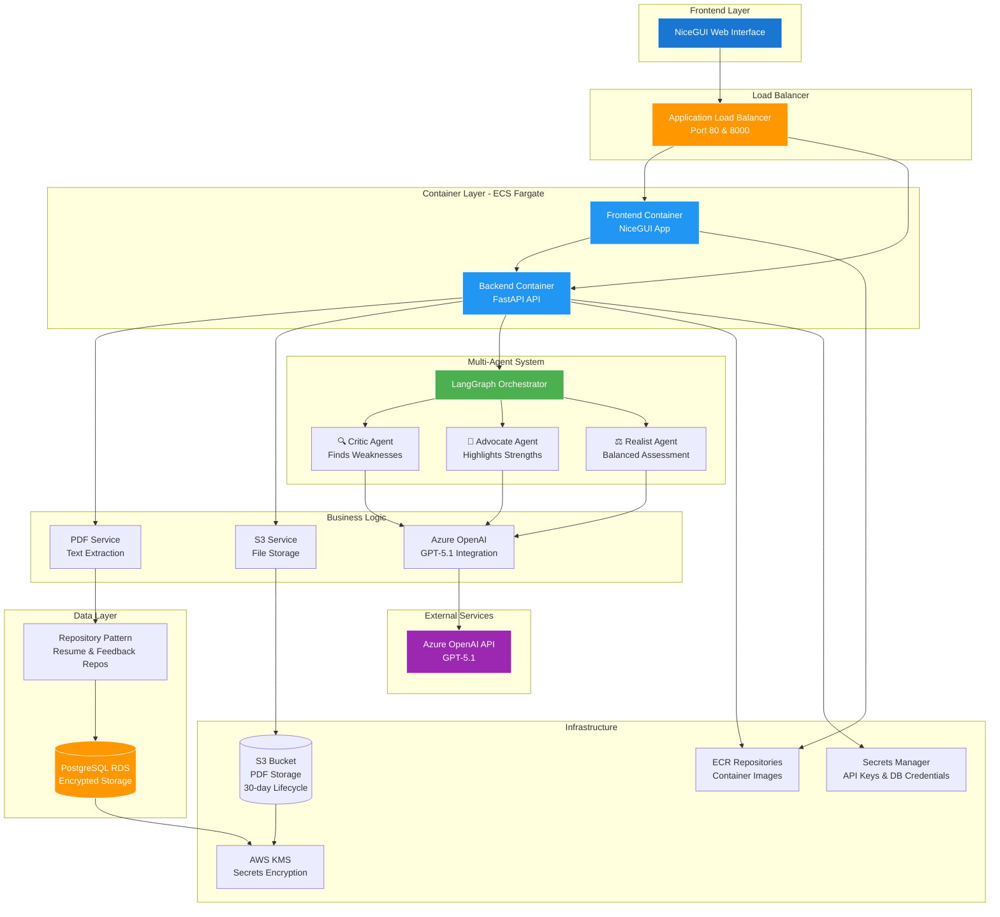

# ResumeRoast - AI-Powered Resume Critique Platform

An intelligent resume critique platform powered by a multi-agent AI system. Get comprehensive feedback through a debate between three specialized AI agents: Critic, Advocate, and Realist.

## 🏗️ Architecture Overview



### Key Architecture Components:
- **Backend**: FastAPI with async operations following SOLID principles
- **Frontend**: NiceGUI reactive web interface  
- **AI System**: Multi-agent LangGraph orchestration (Critic, Advocate, Realist)
- **Database**: PostgreSQL with async SQLAlchemy (RDS in production)
- **Cloud**: AWS with ECS Fargate, RDS, S3, KMS encryption
- **Infrastructure**: Terraform for Infrastructure as Code
- **Containerization**: Docker with multi-stage builds
- **Development**: Docker Compose with LocalStack for AWS services simulation

## 🌟 Key Features

- **Multi-Agent AI System**: Three specialized AI agents analyze your resume from different perspectives
- **Real-time Streaming**: Live response streaming via Server-Sent Events
- **PDF Processing**: Secure document parsing and text extraction
- **Job-Tailored Analysis**: Customizable critiques based on job descriptions
- **Feedback System**: User rating collection for continuous AI improvement
- **Session Management**: Persistent conversation history

## 🚀 Quick Start

### Prerequisites
- Docker and Docker Compose
- Azure OpenAI API access (GPT5.1 deployment)

### 1. Clone and Setup Environment
```bash
git clone <repository-url>
cd resume-roast
cp .env.example .env.docker
# Edit .env.docker with your Azure OpenAI credentials
```

### 2. Start All Services
```bash
# Start PostgreSQL, LocalStack, Backend, and Frontend
docker-compose up -d

# Check service status
docker-compose ps

# View logs if needed
docker-compose logs -f backend
```

### 3. Access the Application
- **Frontend**: http://localhost:8080
- **Backend API**: http://localhost:8000  
- **API Documentation**: http://localhost:8000/docs

### 4. Development Commands
```bash
# Run tests
docker-compose exec backend pytest

# Database migrations
docker-compose exec backend alembic upgrade head

# Create new migration
docker-compose exec backend alembic revision --autogenerate -m "description"

# View service logs
docker-compose logs backend frontend

# Restart services
docker-compose restart backend frontend
```

## 🏭 Production Deployment (AWS ECS Fargate)

### Prerequisites
- AWS CLI configured with appropriate permissions
- Terraform installed
- Docker for building images
- Azure OpenAI API key

### 1. Infrastructure Setup
```bash
cd deployment/terraform

# Initialize Terraform
terraform init

# Review planned infrastructure
terraform plan -var="openai_api_key=your-azure-openai-key-here"

# Deploy infrastructure  
terraform apply -var="openai_api_key=your-azure-openai-key-here"
```

### 2. Build and Deploy Application
```bash
# Get ECR repositories from Terraform output
BACKEND_ECR=$(terraform output -raw ecr_backend_repository_url)
FRONTEND_ECR=$(terraform output -raw ecr_frontend_repository_url)
AWS_REGION=$(terraform output -raw aws_region)

# Login to ECR
aws ecr get-login-password --region $AWS_REGION | docker login --username AWS --password-stdin $BACKEND_ECR

# Build and push backend
docker build -f server/Dockerfile -t backend .
docker tag backend:latest $BACKEND_ECR:latest
docker push $BACKEND_ECR:latest

# Build and push frontend
docker build -f frontend/Dockerfile -t frontend .  
docker tag frontend:latest $FRONTEND_ECR:latest
docker push $FRONTEND_ECR:latest

# Deploy to ECS
aws ecs update-service --cluster resume-roast-cluster --service resume-roast-backend --force-new-deployment
aws ecs update-service --cluster resume-roast-cluster --service resume-roast-frontend --force-new-deployment
```

### 3. Access Your Application
```bash
# Get the load balancer URL
terraform output -raw load_balancer_dns

# Application will be available at:
# - Frontend: http://<load-balancer-dns>
# - Backend: http://<load-balancer-dns>:8000  
# - API Docs: http://<load-balancer-dns>:8000/docs
```

## 📁 Project Structure

```
resume-roast/
├── server/                     # FastAPI Backend
│   ├── main.py                # Application entry point
│   ├── config.py              # Configuration management
│   ├── database.py            # Database setup & connection
│   ├── alembic.ini            # Database migration config
│   ├── api/                   # REST API routes
│   │   ├── routes.py          # Main API endpoints
│   │   └── dependencies.py    # Dependency injection
│   ├── core/                  # Core models & schemas
│   │   ├── models.py          # SQLAlchemy models
│   │   └── schemas.py         # Pydantic schemas
│   ├── agents/                # Multi-agent system
│   │   ├── graph.py           # LangGraph orchestrator
│   │   ├── critic.py          # Critic agent
│   │   ├── advocate.py        # Advocate agent
│   │   └── realist.py         # Realist agent
│   ├── services/              # Business logic
│   │   ├── llm_service.py     # Azure OpenAI integration
│   │   ├── pdf_service.py     # PDF text extraction
│   │   └── s3_service.py      # File storage service
│   ├── repositories/          # Data access layer
│   │   ├── resume_repository.py
│   │   └── feedback_repository.py
│   ├── migrations/            # Database migrations
│   ├── tests/                 # Test suite
│   └── Dockerfile            # Backend container
├── frontend/                  # NiceGUI Frontend
│   ├── app.py                # Web interface
│   └── Dockerfile            # Frontend container
├── deployment/terraform/      # Infrastructure as Code
├── scripts/                   # Utility scripts
│   ├── dev.sh                # Development helper
│   └── deploy.sh             # Deployment script
├── docker-compose.yml        # Local development setup
├── pyproject.toml            # Python dependencies
├── .env.example             # Environment template
└── README.md                # This file
```

## 🔧 Technical Overview

### Backend Architecture (SOLID Principles)
- **Single Responsibility**: Each service handles one specific domain
- **Open/Closed**: Extensible agent system and repository pattern
- **Liskov Substitution**: Abstract base classes for agents and repositories  
- **Interface Segregation**: Focused interfaces for different concerns
- **Dependency Inversion**: Dependency injection container

### Multi-Agent System
- **Critic Agent**: Identifies resume weaknesses and areas for improvement
- **Advocate Agent**: Highlights strengths and positive aspects
- **Realist Agent**: Provides balanced, actionable feedback
- **Orchestrator**: Manages agent coordination and response synthesis

### Security Features
- AWS KMS encryption for sensitive data at rest
- IAM roles with least-privilege principles
- Secrets Manager integration for API keys
- VPC isolation with security groups
- Input validation and file type restrictions

### Performance Optimizations
- Async/await throughout the application stack
- Connection pooling for database operations
- Efficient PDF parsing with memory management
- Streaming responses for real-time user experience
- Auto-scaling ECS services based on demand


### Production (Managed by Terraform)
- Database credentials via AWS Secrets Manager
- Azure OpenAI API key via AWS Secrets Manager
- S3 bucket and KMS keys auto-generated
- ECS task execution roles with required permissions

## 🧪 Testing

```bash
# Run all tests
docker-compose exec backend pytest

# Run with coverage report
docker-compose exec backend pytest --cov=. --cov-report=html

# Run specific test files  
docker-compose exec backend pytest tests/test_api.py
docker-compose exec backend pytest tests/test_pdf_service.py
```

## 🔄 API Endpoints

### Core Endpoints
- `GET /api/v1/health` - Health check
- `POST /api/v1/upload-resume` - Upload resume with optional job description
- `GET /api/v1/stream-analysis/{session_id}` - Stream AI agent analysis
- `POST /api/v1/submit-feedback` - Submit user feedback rating
- `GET /api/v1/session/{session_id}` - Get session details

### Example Usage
```bash
# 1. Upload a resume
curl -X POST "http://localhost:8000/api/v1/upload-resume" \
  -F "file=@resume.pdf" \
  -F "job_description=Senior Python Developer role..."

# 2. Stream analysis (returns session_id from upload)
curl -N "http://localhost:8000/api/v1/stream-analysis/{session_id}"

# 3. Submit feedback
curl -X POST "http://localhost:8000/api/v1/submit-feedback" \
  -H "Content-Type: application/json" \
  -d '{"session_id": "uuid", "rating": 5, "comment": "Great feedback!"}'
```

## 📊 Monitoring and Observability

- **CloudWatch Logs**: Centralized logging for all ECS tasks
- **Application Metrics**: Custom metrics for agent performance
- **Health Checks**: Automated health monitoring for all services
- **Performance Monitoring**: Request timing and error rate tracking

## 🚨 Troubleshooting

### Local Development Issues
```bash
# Reset database
docker-compose down -v
docker-compose up --build

# View service logs
docker-compose logs -f backend
docker-compose logs -f frontend

# Check service health
curl http://localhost:8000/api/v1/health
```

## 📄 License

This project is licensed under the MIT License - see the [LICENSE](LICENSE) file for details.

---

**ResumeRoast v0.1.0** - AI-powered resume feedback through multi-agent debate 🔥